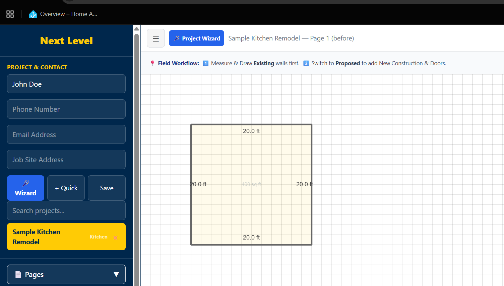

# Next Level — Field Layout Tracker

> A field measurement and layout tool built for tracking room dimensions, walls, and job-site scope directly from the field — before it ever needs a formal drawing set.

**[Live demo →](https://nextlevel.crackerbox.app)**



## What it does

Field Layout Tracker is a lightweight, contractor-focused sketch and measurement tool for capturing existing conditions on-site. Draw walls to scale, note dimensions, and switch between "existing" and "proposed" views to plan new construction, door/window openings, and scope changes — all from a phone or tablet in the field, no CAD software required.

- Draw and measure walls to scale on a live grid
- Toggle between **Existing** and **Proposed** views for before/after planning
- Track project & contact info alongside the layout
- Organize by project category, scope of work, tools, and wall/opening types
- Built as an installable PWA (works offline once loaded)

## Tech stack

- React + TypeScript
- Vite
- Deployed on Netlify

## Project structure

```
src/            React app source
public/         Static assets, PWA manifest & service worker
netlify.toml    Netlify build configuration
```

## Local development

```bash
npm install
npm run dev
```

## Deployment

This project auto-deploys to Netlify on every push to `main`. Build settings live in `netlify.toml`:

```
build command: npm run build
publish dir:   dist
```

---

Built by [Tim Graham](https://github.com/joecracker) — part of the [crackerbox.app](https://crackerbox.app) project family.
